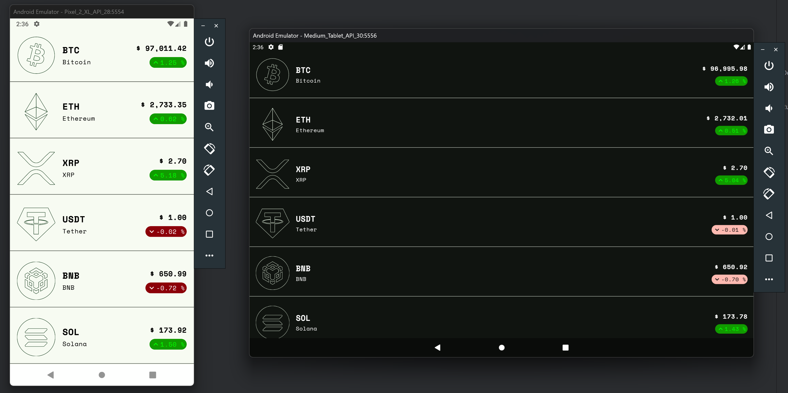
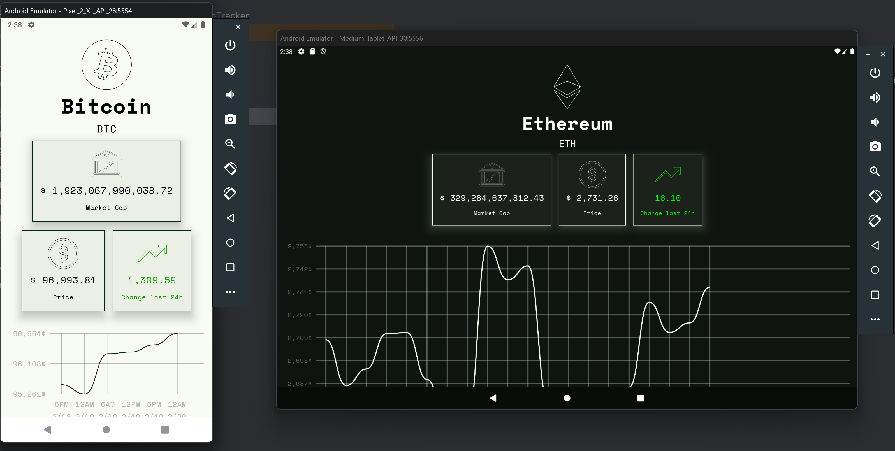
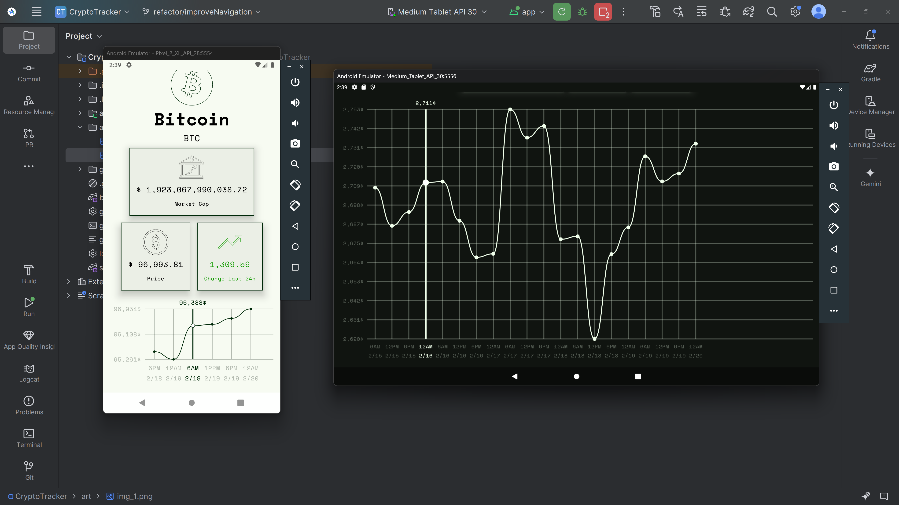

# Welcome to CryptoTracker!

## 📜 Description
Hi! CryptoTracker app the use of MVI Architectural Pattern And Clean Architecture with Jetpack Compose by following Material-3 guidelines along with other MAD libraries such as Dagger-Hilt, Room Database, Coroutines, Navigation etc. for building Android Apps

## 🛠 Built With
|  Architecture   |MVI Architecture Pattern, Clean Architecture |
|----------------   |------------------------------    |
|     UI Framework  | [Jetpack Compose](https://www.jetbrains.com/lp/compose-multiplatform/)         |                        |
| 💉 DI                | [Dagger-Hilt](https://developer.android.com/training/dependency-injection/hilt-android)                        |             |
| :floppy_disk: Local Database      | [Room Database](https://developer.android.com/topic/libraries/architecture/room)                   |
| :compass: Navigation       | [Compose Destinations Navigation](https://developer.android.com/jetpack/compose/navigation) |
| :thread: Asynchronous Work     | [Coroutines](https://kotlinlang.org/docs/reference/coroutines-overview.html)|
<br>

## 🚀 Features
- **➕ View list of Crypto Coins and see detailed chart for each one in details screen**
- **🔔 Notifications:** Receive notifications at the time you set for the routine
- **🌗 Dark/Light Mode:** Toggle between dark and light themes
- **🎨 Dynamic Color:** Enable or disable dynamic color settings
## Demo

<p float="center">
 
</p>

<h2 align="left">Screenshots</h2>
<h4 align="start">



<br>


## License

```
   Copyright (C) 2023-2024  Mahdi Porkar

    This program is free software: you can redistribute it and/or modify
    it under the terms of the GNU General Public License as published by
    the Free Software Foundation, either version 3 of the License, or
    (at your option) any later version.

    This program is distributed in the hope that it will be useful,
    but WITHOUT ANY WARRANTY; without even the implied warranty of
    MERCHANTABILITY or FITNESS FOR A PARTICULAR PURPOSE.  See the
    GNU General Public License for more details.

    You should have received a copy of the GNU General Public License
    along with this program.  If not, see https://www.gnu.org/licenses/.
```
